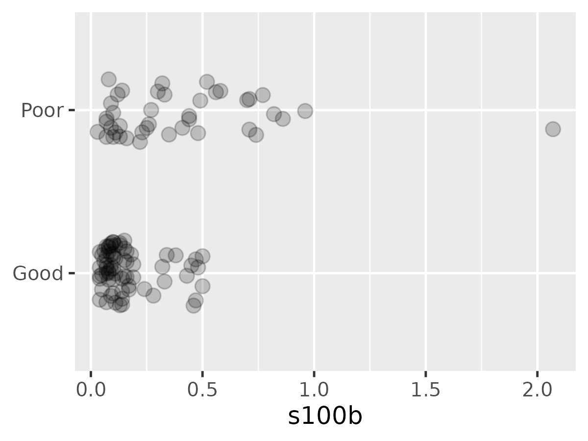
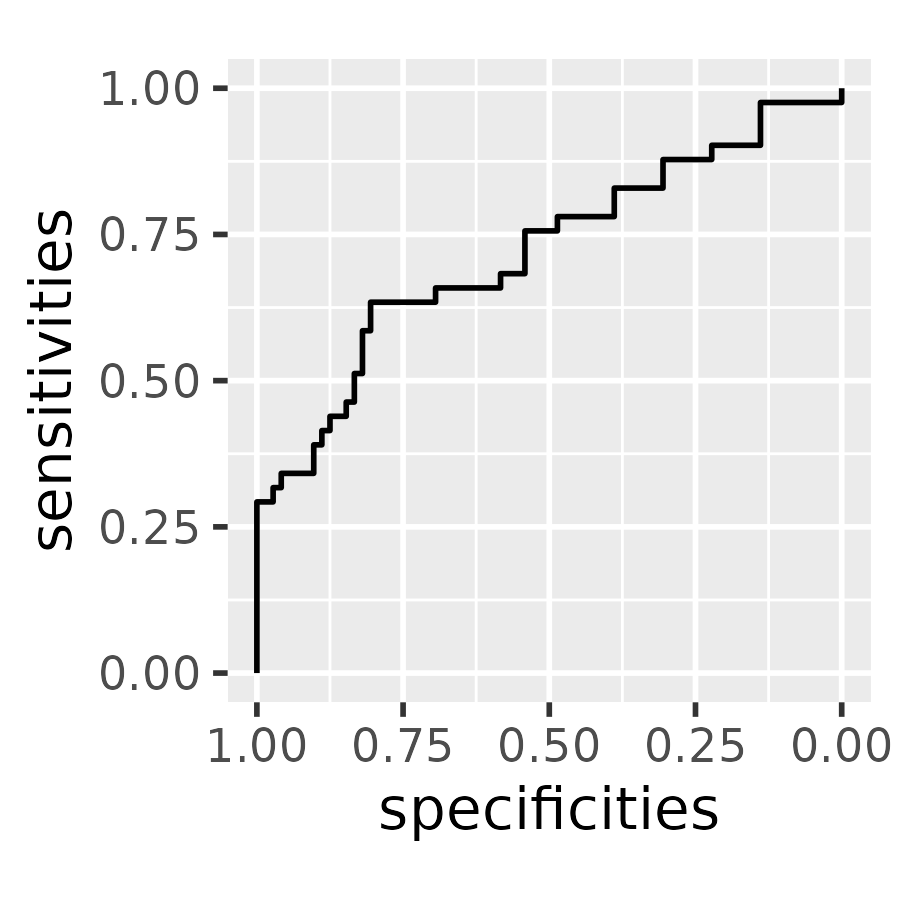
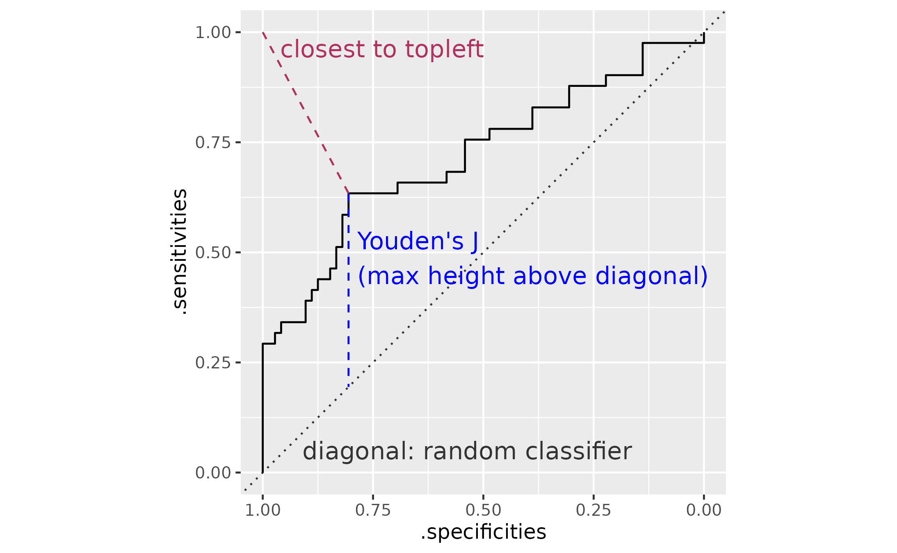

# Tools for ROC curves

``` r
library(tidyverse)
library(wisclabmisc)
library(pROC, exclude = c("cov", "smooth", "var"))
#> Type 'citation("pROC")' for a citation.
```

## A primer on ROC curves

wisclabmisc provides functions for tidying results from ROC curves.
These curves arise in diagnostic or classification settings where we
want to use some test score to determine whether an individual belongs
in a *control* group versus a *case* group. This binary classification
could be normal versus clinical status, regular email versus spam
status, and so on. I use the terminology *control* and *case* to follow
the pROC package’s interface.

In this classification literature, there are tons and tons of statistics
to describe classifier performance. The ROC curve centers around the two
important quantities of [*sensitivity* and
*specificity*](https://en.wikipedia.org/wiki/Sensitivity_and_specificity):

- **sensitivity** is the proportion of true cases correctly identified
  as cases.
  - Also called the *true positive rate* or *recall.*
  - If I apply my spam classifier to 100 spam emails, how many will be
    correctly flagged as spam?
  - P(case result \| case status)
  - *Sensitivity* makes sense to me if I think about the problem as
    detecting something subtle. (Like a Jedi being “force sensitive” or
    Spider-Man’s Spidey sense tingling when he’s in danger.)
- **specificity** is the proportion of true controls correctly
  identified as controls.
  - Also called the *true negative rate* or *selectivity*.
  - If I apply my spam classifier to 100 safe (ham) emails, how many
    will be correctly ignored?
  - P(control result \| control status)
  - *Specificity* is not a great term; *selectivity* makes slightly more
    sense. We don’t want the sensor to trip over noise: It needs to be
    specific or selective.

Suppose our diagnostic instrument provides a score, and we have to
choose a diagnostic threshold for one of these scores. For example,
suppose we decide that scores above 60 indicate that an email is
probably spam and can be moved into the spam folder. Then that threshold
will have its own specificity attached to it. We can look at the
proportion of spam emails that are equal to or above 60 (sensitivity),
and we can look at the proportion of ham emails that are below 60
(specificity). Each number we choose for the threshold will have its own
sensitivity and specificity score, so **an ROC curve is a visualization
of how sensitivity and specificity change along the range of threshold
scores**. (More impenetrable terminology: ROC stands for “receiver
operating characteristic”, having something to do with detections made
by [radar receivers at different operating
levels](https://stats.stackexchange.com/a/398154/14825 "What is the origin of the “receiver operating characteristic” (ROC) terminology?").)

### A worked example

We can work through an example ROC curve using the pROC package. pROC
provides the `aSAH` dataset which provides “several clinical and one
laboratory variable of 113 patients with an aneurysmal subarachnoid
hemorrhage” (hence, `aSAH`).

We have the `outcome` (`Good` versus `Poor`) and some measure called
`s100b`. We can see that that are many more `Good` outcomes near 0 and
there are `Poor` outcomes.

``` r
data <- as_tibble(aSAH)
data
#> # A tibble: 113 × 7
#>    gos6  outcome gender   age wfns  s100b  ndka
#>    <ord> <fct>   <fct>  <int> <ord> <dbl> <dbl>
#>  1 5     Good    Female    42 1      0.13  3.01
#>  2 5     Good    Female    37 1      0.14  8.54
#>  3 5     Good    Female    42 1      0.1   8.09
#>  4 5     Good    Female    27 1      0.04 10.4 
#>  5 1     Poor    Female    42 3      0.13 17.4 
#>  6 1     Poor    Male      48 2      0.1  12.8 
#>  7 4     Good    Male      57 5      0.47  6   
#>  8 1     Poor    Male      41 4      0.16 13.2 
#>  9 5     Good    Female    49 1      0.18 15.5 
#> 10 4     Good    Female    75 2      0.1   6.01
#> # ℹ 103 more rows
count(data, outcome)
#> # A tibble: 2 × 2
#>   outcome     n
#>   <fct>   <int>
#> 1 Good       72
#> 2 Poor       41

ggplot(data) + 
  aes(x = s100b, y = outcome) + 
  geom_point(
    position = position_jitter(width = 0, height = .2),
    size = 3,
    alpha = .2,
  ) +
  theme_grey(base_size = 12) +
  labs(y = NULL)
```



For each point in a grid of points along `s100b`, we can compute the
proportions of patients in each group above or below that threshold. We
can then plot these proportions to visualize the trading relations
between specificity and sensitivity as the threshold changes.

``` r
by_outcome <- split(data, data$outcome)
smallest_diff <- min(diff(unique(sort(data$s100b))))
grid <- tibble(
  threshold = seq(
    min(data$s100b) - smallest_diff, 
    max(data$s100b) + smallest_diff, 
    length.out = 200
  )
)

roc_coordinates <- grid |> 
  rowwise() |> 
  summarise(
    threshold = threshold,
    prop_poor_above = mean(by_outcome$Poor$s100b >= threshold),
    prop_good_below = mean(by_outcome$Good$s100b < threshold),
  )

ggplot(roc_coordinates) + 
  aes(x = threshold) + 
  geom_step(aes(y = prop_poor_above)) + 
  geom_step(aes(y = prop_good_below)) +
  annotate(
    "text", x = 2, y = .9, hjust = 1, vjust = 1, size = 3.25,
    label = "specificity\nproportion of `control` below threshold"
  ) + 
  annotate(
    "text", x = 2, y = .1, hjust = 1, vjust = 0, size = 3.25,
    label = "sensitivity\nproportion of `clinical` above threshold"
  ) +
  labs(
    title = "Sensitivity and specificity as cumulative proportions",
    x = "threshold (diagnosis when score >= threshold)",
    y = NULL,
    subtitle = "threshold direction: control < clinical"
  )
```


It took me about 5 tries to get this plot correct. I am able to convince
myself by noting that all of the `Good` outcomes are less than .51 so
the threshold should not catch a single `Good` outcome above it and
hence have specificity of 1. Conversely, there is just one `Poor`
outcome above 1, so a threshold of 1 is going to detect one `Poor`
outcome and hence have a very low sensitivity.

We can also compute the empirical sensitivity and specificity directly
from the data instead of traversing a grid of thresholds by using the
empirical cumulative distribution function (ECDFs). *Cumulative
distribution* is the proportion of points below each value of x and
*empirical* means that this value is computed directly from the data.

``` r
ggplot(data) + 
  aes(x = s100b) + 
  stat_ecdf(
    data = data |> filter(outcome == "Good"),
  ) +
  stat_ecdf(
    aes(y = 1 - after_stat(ecdf)),
    data = data |> filter(outcome == "Poor")
  ) + 
  labs(
    x = "s100b",
    y = "Empirical distribution functions"
  ) +
  annotate(
    "text", x = 2, y = .9, hjust = 1, vjust = 1,
    label = "specificity\nECDF(x) for `control`"
  ) + 
  annotate(
    "text", x = 2, y = .1, hjust = 1, vjust = 0,
    label = "sensitivity\n1 - ECDF(x) for `clinical`"
  ) +
  labs(
    title = "Sensitivity and specificity as ECDFs",
    x = "threshold (diagnosis when score >= threshold)",
    y = NULL,
    subtitle = "threshold direction: control < clinical"
  )
```


If we ignore the threshold values for our visualization, we can
(finally) plot a canonical ROC curve. It shows specificity in reversing
order so that the most ideal point is the top left corner (sensitivity =
1, specificity = 1).

``` r
roc_coordinates <- roc_coordinates |> 
  rename(
    sensitivities = prop_poor_above, 
    specificities = prop_good_below
  ) |>
  # otherwise the stair-steps look wrong
  arrange(sensitivities)

p <- ggplot(roc_coordinates) + 
  aes(x = specificities, y = sensitivities) + 
  geom_step() +
  scale_x_reverse() + 
  coord_fixed() + 
  theme_grey(base_size = 14)
p
```



We can compare our plot to the one provided by pROC package. We find a
perfect match in our sensitivity and specificity values.

``` r
roc <- pROC::roc(data, response = outcome, predictor = s100b)
#> Setting levels: control = Good, case = Poor
#> Setting direction: controls < cases
plot(roc)
```


``` r

proc_coordinates <- roc[2:3] |> 
  as.data.frame() |> 
  arrange(sensitivities)

# Plot the pROC point as a wide semi-transparent blue
# band on top of ours
p + 
  geom_step(
    data = proc_coordinates, 
    color = "blue",
    alpha = .5,
    linewidth = 2
  )
```


Instead of computing ROC curves by hand, we defer the calculation of ROC
curves to the pROC package because it is easy to get confused when
calculating sensitivity and specificity and because pROC provides other
tools for working with ROC curves. Thus, wisclabmisc’s goal with ROC
curves is to provide helper functions fit ROC curves with pROC and
return the results in a nice dataframe.

We contrast two types of ROC curves:

- an **empirical** ROC curve where the raw data is used to make a jagged
  ROC curve
- a **(smooth) density** ROC curve where the densities of two
  distributions are used to make a smooth ROC curve.

## Emprical ROC curves

Let’s return the above example, predicting the group label `outcome`
(case: `Poor`, control: `Good`) from the predictor `s100b`.

``` r
r <- pROC::roc(data, outcome, s100b)
#> Setting levels: control = Good, case = Poor
#> Setting direction: controls < cases
r
#> 
#> Call:
#> roc.data.frame(data = data, response = outcome, predictor = s100b)
#> 
#> Data: s100b in 72 controls (outcome Good) < 41 cases (outcome Poor).
#> Area under the curve: 0.7314
```

From the messages, we can see that
[`pROC::roc()`](https://rdrr.io/pkg/pROC/man/roc.html) makes a few
decisions for us: that `Good` is the `control` level and `Poor` is the
`case` level, and that controls should have a lower `s100b` than cases.

[`pROC::roc()`](https://rdrr.io/pkg/pROC/man/roc.html) returns an `roc`
object which bundles all of the data and model results together.
Ultimately, we want a the results in a dataframe so that one row will
provide the sensitivity and specificity for each threshold value.

``` r
r
#> 
#> Call:
#> roc.data.frame(data = data, response = outcome, predictor = s100b)
#> 
#> Data: s100b in 72 controls (outcome Good) < 41 cases (outcome Poor).
#> Area under the curve: 0.7314
class(r)
#> [1] "roc"
str(r, max.level = 1, give.attr = FALSE)
#> List of 15
#>  $ percent           : logi FALSE
#>  $ sensitivities     : num [1:51] 1 0.976 0.976 0.976 0.976 ...
#>  $ specificities     : num [1:51] 0 0 0.0694 0.1111 0.1389 ...
#>  $ thresholds        : num [1:51] -Inf 0.035 0.045 0.055 0.065 ...
#>  $ direction         : chr "<"
#>  $ cases             : num [1:41] 0.13 0.1 0.16 0.12 0.44 0.71 0.49 0.07 0.33 0.09 ...
#>  $ controls          : num [1:72] 0.13 0.14 0.1 0.04 0.47 0.18 0.1 0.1 0.04 0.08 ...
#>  $ fun.sesp          :function (...)  
#>  $ auc               : 'auc' num 0.731
#>  $ call              : language roc.data.frame(data = data, response = outcome, predictor = s100b)
#>  $ original.predictor: num [1:113] 0.13 0.14 0.1 0.04 0.13 0.1 0.47 0.16 0.18 0.1 ...
#>  $ original.response : Factor w/ 2 levels "Good","Poor": 1 1 1 1 2 2 1 2 1 1 ...
#>  $ predictor         : num [1:113] 0.13 0.14 0.1 0.04 0.13 0.1 0.47 0.16 0.18 0.1 ...
#>  $ response          : Factor w/ 2 levels "Good","Poor": 1 1 1 1 2 2 1 2 1 1 ...
#>  $ levels            : chr [1:2] "Good" "Poor"
```

We can get close to a dataframe by manipulating the list or by using
[`coords()`](https://rdrr.io/pkg/pROC/man/coords.html).
[`pROC::coords()`](https://rdrr.io/pkg/pROC/man/coords.html) has
additional features that allow it to identify the “best” ROC points, but
it strips off useful data like the direction used.

``` r
r[1:5] |> 
  as.data.frame() |> 
  tibble::as_tibble()
#> # A tibble: 51 × 5
#>    percent sensitivities specificities thresholds direction
#>    <lgl>           <dbl>         <dbl>      <dbl> <chr>    
#>  1 FALSE           1            0        -Inf     <        
#>  2 FALSE           0.976        0           0.035 <        
#>  3 FALSE           0.976        0.0694      0.045 <        
#>  4 FALSE           0.976        0.111       0.055 <        
#>  5 FALSE           0.976        0.139       0.065 <        
#>  6 FALSE           0.902        0.222       0.075 <        
#>  7 FALSE           0.878        0.306       0.085 <        
#>  8 FALSE           0.829        0.389       0.095 <        
#>  9 FALSE           0.780        0.486       0.105 <        
#> 10 FALSE           0.756        0.542       0.115 <        
#> # ℹ 41 more rows

pROC::coords(r) |> 
  tibble::as_tibble()
#> # A tibble: 51 × 3
#>    threshold specificity sensitivity
#>        <dbl>       <dbl>       <dbl>
#>  1  -Inf          0            1    
#>  2     0.035      0            0.976
#>  3     0.045      0.0694       0.976
#>  4     0.055      0.111        0.976
#>  5     0.065      0.139        0.976
#>  6     0.075      0.222        0.902
#>  7     0.085      0.306        0.878
#>  8     0.095      0.389        0.829
#>  9     0.105      0.486        0.780
#> 10     0.115      0.542        0.756
#> # ℹ 41 more rows
```

wisclabmisc provides
[`compute_empirical_roc()`](https://www.tjmahr.com/wisclabmisc/reference/compute_empirical_roc.md)
which combines results from
[`pROC::roc()`](https://rdrr.io/pkg/pROC/man/roc.html) and
[`pROC::coords()`](https://rdrr.io/pkg/pROC/man/coords.html) into a
tibble. It includes metadata about the `.controls` and `.cases` levels,
the `.direction` of the relationship, and the overall `.auc` of the
curve. It also identifies two “best” coordinates with `.is_best_youden`
and `is_best_closest_topleft`. Finally, it retains the name of the
predictor variable.

``` r
compute_empirical_roc(data, outcome, s100b)
#> ℹ No `levels` provided. Using `levels = c("Good", "Poor")`.
#> • Setting control to outcome == "Good".
#> • Setting case to outcome == "Poor".
#> Setting direction: controls < cases
```

We can still see the messages emitted by the
[`pROC::roc()`](https://rdrr.io/pkg/pROC/man/roc.html) call when we use
[`compute_empirical_roc()`](https://www.tjmahr.com/wisclabmisc/reference/compute_empirical_roc.md).
We can pass the arguments `direction` and `levels` to
[`pROC::roc()`](https://rdrr.io/pkg/pROC/man/roc.html) to silence these
messages.

``` r
data_roc <- compute_empirical_roc(
  data, 
  outcome, 
  s100b, 
  direction = "<",
  levels = c("Good", "Poor")
)
data_roc
#> # A tibble: 51 × 11
#>       s100b .specificities .sensitivities  .auc .direction .controls .cases
#>       <dbl>          <dbl>          <dbl> <dbl> <chr>      <chr>     <chr> 
#>  1 -Inf             0               1     0.731 <          Good      Poor  
#>  2    0.035         0               0.976 0.731 <          Good      Poor  
#>  3    0.045         0.0694          0.976 0.731 <          Good      Poor  
#>  4    0.055         0.111           0.976 0.731 <          Good      Poor  
#>  5    0.065         0.139           0.976 0.731 <          Good      Poor  
#>  6    0.075         0.222           0.902 0.731 <          Good      Poor  
#>  7    0.085         0.306           0.878 0.731 <          Good      Poor  
#>  8    0.095         0.389           0.829 0.731 <          Good      Poor  
#>  9    0.105         0.486           0.780 0.731 <          Good      Poor  
#> 10    0.115         0.542           0.756 0.731 <          Good      Poor  
#> # ℹ 41 more rows
#> # ℹ 4 more variables: .n_controls <int>, .n_cases <int>, .is_best_youden <lgl>,
#> #   .is_best_closest_topleft <lgl>
```

According to the help page for
[`pROC::coords()`](https://rdrr.io/pkg/pROC/man/coords.html) is Youden’s
J statistic is the point that is farthest vertical distance from the
diagonal line. The other “best” point is the point closest to the
upper-left corner. The following plot labels each of these distances.
The Youden’s point and the topleft point here are the same point.

``` r
data_roc <- data_roc |> 
  arrange(.sensitivities)

p_best <- ggplot(data_roc) + 
  aes(x = .specificities, y = .sensitivities) + 
  geom_abline(
    slope = 1, 
    intercept = 1, 
    linetype = "dotted", 
    color = "grey20"
  ) +
  geom_step() + 
  geom_segment(
    aes(xend = .specificities, yend = 1 - .specificities),
    data = function(x) filter(x, .is_best_youden),
    color = "blue",
    linetype = "dashed"
  ) + 
  geom_segment(
    aes(xend = 1, yend = 1),
    data = function(x) filter(x, .is_best_closest_topleft),
    color = "maroon",
    linetype = "dashed"
  ) + 
  # Basically, finding a point 9/10ths of the way
  # along the line
  geom_text(
    aes(
      x = weighted.mean(c(1, .specificities), c(9, 1)), 
      y = weighted.mean(c(1, .sensitivities), c(9, 1)), 
    ),
    data =  function(x) filter(x, .is_best_closest_topleft),
    color = "maroon",
    label = "closest to topleft",
    hjust = 0, 
    nudge_x = .02,
    size = 5
  ) + 
  geom_text(
    aes(
      x = .specificities, 
      y = weighted.mean(c(1 - .specificities, .sensitivities), c(1, 2)), 
    ),
    data =  function(x) filter(x, .is_best_youden),
    color = "blue",
    label = "Youden's J\n(max height above diagonal)",
    hjust = 0,
    vjust = .5,
    nudge_x = .02,
    size = 5
  ) + 
  annotate(
    "text",
    x = .91,
    y = .05,
    hjust = 0, 
    size = 5,
    label = "diagonal: random classifier",
    color = "grey20"
  ) +
  scale_x_reverse() +
  coord_fixed() +
  theme_grey(base_size = 12)
p_best
```



### Empirical ROC curves on weighted data

[`pROC::roc()`](https://rdrr.io/pkg/pROC/man/roc.html) does not support
observation weights, so this package provides
[`compute_sens_spec_from_ecdf()`](https://www.tjmahr.com/wisclabmisc/reference/compute_sens_spec_from_ecdf.md)
to compute sensitivity and specificity using (weighted) ECDFs. If not
weights are provided, the normal unweighted results are used. This
function does not use
[`pROC::roc()`](https://rdrr.io/pkg/pROC/man/roc.html) at all.

To simulate weighting, we will round the existing predictor and count
the number of observations in each bin (rounded value). That count is
the weight.

``` r
data_bin <- data |> 
  mutate(s100b_bin = round(s100b, 1)) |> 
  group_by(outcome, s100b_bin) |> 
  summarise(
    n = n(),
    .groups = "drop"
  )

data_sens_spec <- compute_sens_spec_from_ecdf(
  data_bin, 
  response = outcome, 
  predictor = s100b_bin, 
  weights = n,
  direction = "case-high", 
  levels = c("Good", "Poor")
)
```

For comparison, use the pROC-based approach on the rounded data. Here we
have the manually computed ROC-curve on weighted data in black and the
pROC-computed ROC data on unweighted data.

``` r
data_sens_spec2 <- data |> 
  mutate(s100b_bin = round(s100b, 1)) |> 
  compute_empirical_roc(
    response = outcome, 
    predictor = s100b_bin, 
    direction = "case-high", 
    levels = c("Good", "Poor")
  )

ggplot(data_sens_spec) + 
  aes(x = .specificities, y = .sensitivities) + 
  geom_step(
    direction = "vh", 
    data = data_sens_spec2, 
    color= "orange", 
    alpha = .5, 
    linewidth = 2
  ) +
  geom_step(direction = "vh") +
  scale_x_reverse()
```


## (Smooth) density ROC curves

Instead of looking at the observed data, let’s assume the `s100b` values
in each group are drawn from a normal distribution but the means and
scales (standard deviations) are different for the two groups. We can
compute each group’s mean and standard deviation and then plot the
normal density curves on top of each other. Pepe (2003) refers to this
approach as the “binormal ROC curve”.

``` r
data_stats <- data |> 
  group_by(outcome) |> 
  summarise(
    mean = mean(s100b),
    sd = sd(s100b)
  ) 

l_control <- data_stats |> 
  filter(outcome == "Good") |> 
  as.list()

l_case <- data_stats |> 
  filter(outcome != "Good") |> 
  as.list()

ggplot(data) + 
  aes(x = s100b, color = outcome) + 
  # include a "rug" at the bottom
  geom_jitter(aes(y = -.2), width = 0, height = .15, alpha = .4) +
  stat_function(
    data = function(x) filter(x, outcome == "Good"),
    fun = dnorm, 
    args = list(mean = l_control$mean, sd = l_control$sd)
  ) +
  stat_function(
    data = function(x)filter(x, outcome != "Good"),
    fun = dnorm, 
    args = list(mean = l_case$mean, sd = l_case$sd)
  ) +
  geom_text(
    aes(x = mean, y = dnorm(mean, mean, sd), label = outcome),
    data = data_stats,
    vjust = "inward",
    hjust = 0,
    nudge_x = .05,
    nudge_y = .05,
    size = 4
  ) +
  theme_grey(14) +
  theme(legend.position = "top", legend.justification = "left") +
  labs(y = NULL) +
  guides(color = "none")
```


At various points along the *x*-axis range,
[`stat_function()`](https://ggplot2.tidyverse.org/reference/geom_function.html)
compute [`dnorm()`](https://rdrr.io/r/stats/Normal.html) (the density of
the normal curves). We can do that by hand too. We take the full range
of the data, and then within each group, generate a set of points along
that range and compute that group’s density at each point.

``` r
data_grid <- data |> 
  mutate(
    xmin = min(s100b),
    xmax = max(s100b)
  ) |> 
  group_by(outcome) |> 
  reframe(
    x = seq(xmin[1], xmax[1], length.out = 200),
    group_mean = mean(s100b),
    group_sd = sd(s100b),
    density = dnorm(x, group_mean, group_sd),
    .groups = "drop"
  ) 
data_grid
#> # A tibble: 400 × 6
#>    outcome      x group_mean group_sd density .groups
#>    <fct>    <dbl>      <dbl>    <dbl>   <dbl> <chr>  
#>  1 Good    0.03        0.162    0.131    1.84 drop   
#>  2 Good    0.0403      0.162    0.131    1.98 drop   
#>  3 Good    0.0505      0.162    0.131    2.13 drop   
#>  4 Good    0.0608      0.162    0.131    2.27 drop   
#>  5 Good    0.0710      0.162    0.131    2.40 drop   
#>  6 Good    0.0813      0.162    0.131    2.53 drop   
#>  7 Good    0.0915      0.162    0.131    2.64 drop   
#>  8 Good    0.102       0.162    0.131    2.75 drop   
#>  9 Good    0.112       0.162    0.131    2.84 drop   
#> 10 Good    0.122       0.162    0.131    2.91 drop   
#> # ℹ 390 more rows
```

Next, we pivot to a wide pivot format because we will be comparing the
two densities at each point.

``` r
data_dens <- data_grid |> 
  rename(s100b = x) |> 
  select(-group_mean, -group_sd) |> 
  pivot_wider(names_from = outcome, values_from = density)
data_dens
#> # A tibble: 200 × 4
#>     s100b .groups  Good  Poor
#>     <dbl> <chr>   <dbl> <dbl>
#>  1 0.03   drop     1.84 0.659
#>  2 0.0403 drop     1.98 0.676
#>  3 0.0505 drop     2.13 0.694
#>  4 0.0608 drop     2.27 0.711
#>  5 0.0710 drop     2.40 0.729
#>  6 0.0813 drop     2.53 0.746
#>  7 0.0915 drop     2.64 0.763
#>  8 0.102  drop     2.75 0.780
#>  9 0.112  drop     2.84 0.797
#> 10 0.122  drop     2.91 0.813
#> # ℹ 190 more rows
```

[`pROC::roc()`](https://rdrr.io/pkg/pROC/man/roc.html) can compute an
ROC curve from these densities. Note that the interface here is
different. We do not provide a dataframe and names of columns in that
data frame. Instead, we provide two vectors of densities, and in fact,
those densities are lost after computing the ROC curve.

``` r
data_dens <- arrange(data_dens, s100b)
r_dens <- roc(
  density.controls = data_dens$Good, 
  density.cases = data_dens$Poor
)
r_dens
#> 
#> Call:
#> roc.default(density.controls = data_dens$Good, density.cases = data_dens$Poor)
#> 
#> Data: (unknown) in 0 controls ((unknown) )  0 cases ((unknown) ).
#> Smoothing: density with controls: data_dens$Good; and cases: data_dens$Poor
#> Area under the curve: 0.8299
plot(r_dens)
```


The `roc` object here returns the coordinates with sensitivity in
decreasing order, so it is not obvious how to map these sensitivities
back to the original densities. In terms of the earlier density plot, we
don’t know whether the sensitivities move up the *x* axis or down the
*x* axis.

Let’s restate the problem again, for clarity:

- We want to map thresholds to densities to ROC coordinates and map ROC
  coordinates back to densities to thresholds.
- With `pROC::roc(density.controls, density.controls)`, we hit a brick
  wall and cannot map backwards from ROC coordinates because the
  sensitivites may have been reversed with respect to the densities.

Fortunately, if we compute the sensitivities by hand, we can figure out
how the coordinates were ordered. We try both orderings and find the one
that best matches one provided by
[`pROC::roc()`](https://rdrr.io/pkg/pROC/man/roc.html).

``` r
# direction > : Good > threshold >= Poor
sens_gt <- rev(cumsum(data_dens$Poor) / sum(data_dens$Poor))
# direction < : Good < threshold <= Poor
sens_lt <- 1 - (cumsum(data_dens$Poor) / sum(data_dens$Poor))
# The model did ??
fitted_sensitivities <- r_dens$sensitivities[-c(1, 201)]

mean(fitted_sensitivities - sens_lt)
#> [1] 0.004999997
mean(fitted_sensitivities - sens_gt)
#> [1] -0.530585
```

Because the `<` direction better matched the ROC results, we conclude
that the sensitivities follow the same order as the densities.

[`compute_smooth_density_roc()`](https://www.tjmahr.com/wisclabmisc/reference/compute_smooth_density_roc.md)
uses a similar heuristic to determine the order of the ROC coordinates
with respect to the original densities. As a result, we can map the
original threshold values to sensitivity and specificity values. The
function also lets us use column names directly.

``` r
data_smooth <- compute_smooth_density_roc(
  data = data_dens, 
  controls = Good, 
  cases = Poor, 
  along = s100b
)
data_smooth
#> # A tibble: 202 × 11
#>     s100b .groups  Good  Poor .sensitivities .specificities  .auc .roc_row
#>     <dbl> <chr>   <dbl> <dbl>          <dbl>          <dbl> <dbl>    <int>
#>  1 0.03   drop     1.84 0.659          1             0      0.830        2
#>  2 0.0403 drop     1.98 0.676          0.992         0.0221 0.830        3
#>  3 0.0505 drop     2.13 0.694          0.984         0.0460 0.830        4
#>  4 0.0608 drop     2.27 0.711          0.975         0.0716 0.830        5
#>  5 0.0710 drop     2.40 0.729          0.967         0.0989 0.830        6
#>  6 0.0813 drop     2.53 0.746          0.958         0.128  0.830        7
#>  7 0.0915 drop     2.64 0.763          0.949         0.158  0.830        8
#>  8 0.102  drop     2.75 0.780          0.939         0.190  0.830        9
#>  9 0.112  drop     2.84 0.797          0.930         0.223  0.830       10
#> 10 0.122  drop     2.91 0.813          0.920         0.257  0.830       11
#> # ℹ 192 more rows
#> # ℹ 3 more variables: .direction <chr>, .is_best_youden <lgl>,
#> #   .is_best_closest_topleft <lgl>
```

[`compute_smooth_density_roc()`](https://www.tjmahr.com/wisclabmisc/reference/compute_smooth_density_roc.md)
also provides coordinates for the “best” thresholds by the Youden or
topleft criteria. Because of the consistency between the two functions,
we can just replace the data used to make annotated ROC curve with the
smoothed ROC coordinates. In this case, the Youden and topleft points
are different.

``` r
p_best + list(data_smooth)
```


As a final demonstration, let’s compare the smooth and empirical ROC
sensitivity and specificity values along the threshold values.

``` r
ggplot(data_smooth) + 
  aes(x = s100b) + 
  geom_line(
    aes(color = "smooth", linetype = "smooth", y = .sensitivities),
  ) + 
  geom_line(
    aes(color = "empirical", linetype = "smooth", y = .sensitivities),
    data = data_roc
  ) + 
  geom_line(
    aes(color = "smooth", linetype = "empirical", y = .specificities)
  ) + 
  geom_line(
    aes(color = "empirical", linetype = "empirical", y = .specificities),
    data = data_roc
  ) +
  annotate("text", x = 2, y = .9, hjust = 1, label = "specificity") + 
  annotate("text", x = 2, y = .1, hjust = 1, label = "sensitivity") +
  labs(
    color = "ROC type", 
    linetype = "ROC type",
    y = NULL
  ) + 
  theme_grey(base_size = 12) + 
  theme(legend.position = "top")
#> Warning: Removed 2 rows containing missing values or values outside the scale range
#> (`geom_line()`).
#> Removed 2 rows containing missing values or values outside the scale range
#> (`geom_line()`).
```


