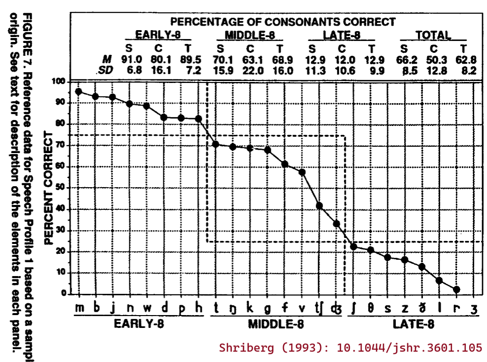

## What is the purpose of these phonetic features?

The features provided by this package are meant to provide a standard
set of phonetic features for the American English speech samples that we
study in our lab. But why? 

When we are modeling something at the phoneme level, like articulation
accuracy or phoneme probabilities from acoustic models, we would like to
**incorporate and evaluate our domain knowledge** about phonemes (speech
sounds) into our work. There are many speech sounds but the differences
among them are not arbitrary. We can use **phonetic features** to group
speech sounds together and make group comparisons: consonants versus
vowels, voiced versus voiceless consonants, and so on. We can also use
phonetic features to identify an articulatory "distance" between
phonemes: Phonemes with more features in common are more similar than
those with fewer features in common.


<!-- Our descriptions of child speech are often descriptions of phonetic features: *fronting* is the systematic production of back consonants like /k/ with a frontal place of articulation like /t/. An early advantage for  -->


## What are phonetic features, like, philosophically?

We produce most speech sounds by manipulating airflow from the lungs
through the larynx and through the oral or nasal cavities. We need a
system for describing how that airflow is shaped and filtered to make
sounds, and phonetic features are the conventional system for describing
sounds. I based the phonetic features in this package on the dimensions
used by the International Phonetic Association to organize the
International Phonetic Alphabet (IPA) chart. 

First, let's make a few assumptions:
  
1.  There are discrete speech sounds.
2.  Each sound is an attempt at a particular configuration of speech
    articulators.
3.  Vowels and consonants are different kinds of things.

Assumptions 1 and 2 are stated by the IPA handbook (1999): "Phonetic analysis
is based on the crucial premise that it is possible to describe speech
sounds in terms of a sequence of segments, and on the further crucial
assumption that each segment can be characterized by an articulatory
target"  I read this in two ways. The first is that although speech is a
continuous and highly coordinated sequence of movements, we can break it 
down into more discrete states (speech sound segments) and we
can describe those states in terms of a particular configuration of the
speaker's jaw, lips, tongue, and so on (articulatory target). My second
reading emphasizes the word *target*. The target is a broad description
of an ideal or canonical position, but speakers can make small
adjustments as long they hit the general articulatory targets. So, we
are working at a usefully broad level of description when we list off
the sounds of a language and their phonetic features.

Assumption 3, is that there is a basic distinction between vowels and
consonants. There is some difference in articulation between vowels and
consonants. For vowels, the airflow is almost-always resonant (voicing
from the larynx) and largely unobstructed but tweaked by the position of
the tongue. For consonants, there is some constriction along the vocal
tract. But the primary conventional difference between consonants and
vowels is that vowels can be the "nucleus" (center) of a syllable, and
consonants generally cannot be the occupy the center of a syllable.

Putting this all together: phonetic features describe consonants and
vowels in terms of the articulatory states or gestures needed to make
those sounds.

### Features of consonants

We describe the consonants by using phonetic features that specify the
constriction in the vocal tract along with the state of larynx.

  - **place of articulation**: where the constriction occurs. When the
    lips create the closure, the place of articulation can be *bilabial*
    (both lips) and *labiodental* (bottom lip and top teeth). The tongue
    creates the closure, the place of articulation can be *dental*
    (tongue touches top teeth or goes between the top and bottom teeth),
    *alveolar* (at the alveolar ridge), *post-alveolar* (towards the
    "back" of the alveolar ridge), *palatal* (at the hard palate),
    *velar* (at the velum or front of the soft palate). The larynx may
    create a closure in a *glottal* consonant. Finally, both the lips
    and back of the tongue constrict in English's *labiovelar* consonant
    /w/.

  - **manner of articulation**: how much constriction occurs and whether
    anything else special is going on. We consider three main degrees of
    constriction. Sounds that barely constrict are *approximants*. Two
    approximants (/j,w/) are called *semivowels*; if you prolong
    them, they resemble vowels (/i,u/). Sounds where the constriction
    fully stops airflow are *stops*. When the stop is released, there is
    a burst of airflow and acoustic energy, so stops are also called
    *plosives*. Sounds that constrict enough to produce
    turbulent airflow are *fricatives*. Other manners of articulation
    are variations on these three levels of constriction. *Nasal* stops
    are stops that allow airflow through the nasal cavity. *Affricates*
    are a combination of a stop and fricative: The stop portion blocks
    airflow but the flow is released gradually into a fricative. In
    terms of articulation, /l/ and /r/ are both approximants but they
    are sometimes lumped under the fake umbrella term of *liquids*. 
  
  - **voicing**: whether the vocal folds in the larynx are closed and
    vibrating to produce voicing. /s/ and /z/ are two sounds that share
    the same place and manner of articulation (alveolar fricatives), but
    differ in their voicing. /s/ is *voiceless*, /z/ is *voiced*.


The chart of the [International Phonetic
Alphabet](https://en.wikipedia.org/wiki/International_Phonetic_Alphabet_chart)
arranges consonant sounds according to the above three features of place of
articulation (columns), manner of articulation (rows) and voicing (left and
right position in a cell).

### Features of vowels

Vowels are much trickier. First, they are described along three main
axes:

  - **height** of the tongue body. Conventions vary for how many height
    levels we should use to describe English vowels. I originally had
    three levels (*high*, *mid*, *low*) but now I have four levels of
    vowel height: *high* (e.g., /i/ in "beet"), *mid-high* (/ɪ/, "bit"),
    *mid-low* (/ɛ/, "bet"), and *low* (/æ/ as in "bat"). An alternate
    set of terms for high/low is close/open, where "close" describes the
    tongue being *close* to the roof of the mouth.
  
  - **backness** of the tongue body. /i/ (as in "beet") is a *front*
    vowel, /ʌ/ (as in "butt") is a *central* vowel, and /u/ (as in
    "boot") is a *back* vowel.
  
  - **rounding** of the lips. Rounding or protrusion of the lips
    lengthens the vocal tract which lowers the formant frequencies
    (resonances) of the vowel. In American English, rounding does not
    differentiate vowels from each other, except arguably in one case:
    /ɑ/ (as in "bot") is a low back *unrounded* vowel and /ɔ/ (as in
    "bought") is a mid-low back *rounded* vowel. There is a tendency for
    these two vowels to [merge into one
    sound](https://en.wikipedia.org/wiki/Cot%E2%80%93caught_merger).

The [IPA
chart](https://en.wikipedia.org/wiki/International_Phonetic_Alphabet_chart)
for vowels uses the height and backness features to arrange the sounds
into the "vowel quadrilateral". Within each height-backness combination,
the chart further differentiates between an unrounded and rounded vowel
in that position. The vowels at the most extreme height (high, low) and
backness (front, back) values make up the *corner* vowels /i, æ, u, ɑ/.


When we only use three levels of height (high-mid-low), the articulatory
features above are not sufficient to differentiate the vowels of
English. By convention, we include a fake feature to further describe
basic English vowels:

  - **tenseness** of the vowel articulation. Both /i/ (as in "beet") and
    /ɪ/ (as in "bit") are relatively high front vowels, so we
    conventionally differentiate these two vowels by stipulating that
    /i/ is *tense* and /ɪ/ is *lax*. Other tense-lax pairs are /u,ʊ/
    ("boot" and "book") and /eɪ,ɛ/ ("bait" and "bet").

It's unclear what differentiates these tense and lax sounds in terms of
speech articulation. Chomsky and Halle (1991) appealed to a vague
articulatory difference in effort:

> Phonetically the difference between tense and lax vowels sounds can
> best be characterized a difference in the manner in which the
> articulatory gesture is executed. A tense sound is executed
> deliberately so that the articulating organs actually attain their
> various target configurations; in producing a lax sound, the gesture
> is executed rapidly and with reduced amplitude. Tense vowels are,
> therefore, distinguished from the corresponding lax vowels by being
> more intense, of longer duration, and articulated with a greater
> deviation of the vocal cavity from its neutral (rest) position. These
> facts have led to the description of lax vowels as being the "lazy"
> variances of the corresponding tense vowels.

But I take this description with a grain of salt because they were doing
a very theoretical and computational description of English sounds.
Ladefoged and Johnson (2010) instead claim that the difference is
largely distributional:

> These terms [*tense*, *lax*] are really just labels used to
> designate two groups of vowels that behave differently in English
> words. There are phonetic differences between the two groups, but they
> are not simply a matter of muscular tenseness versus laxness. [...]
> The difference between the two sets can be discussed in terms of the
> different kinds of syllables in which they can occur.

They go on to describe how lax vowels don't occur in open syllables
(i.e., syllables that end in a vowel) and how tense-lax pairs are not
differentiated in syllables before /r/ or /ŋ/. When speakers don't have
to differentiate tense-lax vowels in a certain context, they get looser
with their production: "In a syllable closed by /r/, there is no
contrast in quality between a tense vowel and the lax vowel nearest to
it. Consequently, as often happens in contexts in which there is no
opposition between two sounds, the actual sound produced is somewhere
between the two" (Ladefoged & Johnson, 2010).

So, tenseness is a standard feature of English vowels, but it is not
clear what it means in terms of an articulatory configuration. It is
plausible that tense and lax vowels differ in height (Johnson,
Ladefoged, & Lindau, 1993), and the IPA chart differentiates the high
front vowels by placing /ɪ/ just a smidge lower than /i/ (*near-close*
as instead of *close*). For this reason, I encode the tense-lax pairs as
differing in height too: /i/-/ɪ/ (high, mid-high), /u/-/ʊ/ (high,
mid-high), /eɪ/-/ɛ/ (mid-high, mid-low). But in a high-mid-low system,
the only difference with these pairs would their tenseness feature.

The features described so far specify the basic English vowels. When I
assign these vowels a manner of articulation feature, I used the feature
*vowel*. There are two other kinds of vowel manners in English:

  - **diphthongs** are "double vowels". They are characterized by
    movement from an initial height-backness location to another
    height-backness location. The three classic diphthongs of English
    are /aɪ/ (as in "bite"), /ɔɪ/ ("boy"), and /aʊ/ ("bout"). We also
    conventionally transcribe /eɪ/ ("bait") and /oʊ/ ("boat") using two
    vowel characters but these are classified as regular single vowels
    (or *monophthongs*).

  - **r-colored vowels** are produced with a /r/-like quality to them,
    either by bunching the tongue or raising the tongue tip.

Before putting everything together, I need to highlight a final
convention in English vowels. We typically represent the neutral vowel
sound (central, low-mid, unrounded) sound in two different ways: /V/ for
stressed vowels (as in "butt") and /UH/ for unstressed vowels (second
syllable of "comma"). This convention also carries over to the r-colored
vowels with stressed /ER/ ("burt") and unstressed /er/ (second syllable
of "letter").

***

I don't consider /eɪ/ and /oʊ/ to be diphthongs, but perhaps `manner_alt`
could encode the difference of these vowels from the others.

In the CMU alphabet and ARPAbet, vowels can include a number to indicate
vowel stress, so `AH1` or `AH2` is /ʌ/ but `AH0` is /ə/.

The vowel features for General American English,
[according to Wikipedia](https://en.wikipedia.org/wiki/English_phonology),
are as follows:

<table style="text-align: center;">
<tbody>
<tr class="header">
<th rowspan="2"></th>
<th colspan="2">Front</th>
<th colspan="2">Central</th>
<th colspan="2">Back</th>
</tr>
<tr class="odd">
<th>lax</th>
<th>tense</th>
<th>lax</th>
<th>tense</th>
<th>lax</th>
<th>tense</th>
</tr>

<tr class="odd">
<th>Close</th>
<td>ɪ</td>
<td>i</td>
<td></td>
<td></td>
<td>ʊ</td>
<td>u</td>
</tr>
<tr class="even">
<th>Mid</th>
<td>ɛ</td>
<td>eɪ</td>
<td>ʌ (stressed)<br/>ə (unstressed)</td>
<td></td>
<td></td>
<td>oʊ</td>
</tr>
<tr class="odd">
<th>Open</th>
<td>æ</td>
<td></td>
<td>(ʌ)</td>
<td>ɑ</td>
<td></td>
<td>(ɔ)</td>
</tr>
<tr class="even">
<th>Diphthongs</th>
<td colspan="6">aɪ ɔɪ aʊ</td>
</tr>
<th>/r/-colored</th>
<td colspan="6">ɝ ɚ</td>
</tr>
</tbody>
</table>

I adapted these features in this way:

- *tense* and *lax* features were directly borrowed. Diphthongs and
  r-colored vowels are were not assign a tenseness.
- /ʌ,ɔ/ raised to *mid* (following the general IPA chart)
- /ɑ/ moved to *back* (following the general IPA)
- diphthongs have no backness or height
- r-colored vowels were given the backness and height of the /ʌ,ə/

Based on the assumption that /ʌ,ə/ are the same general vowel with
differing stress, these vowels have the same features. This definition
clashes with the general IPA chart which places /ʌ/ as a back vowel. However,
/ʌ/ is a conventional notation. Quoting
[Wikipedia](https://en.wikipedia.org/wiki/English_phonology) again:
"Although the notation /ʌ/ is used for the vowel of STRUT in RP and General
American, the actual pronunciation is closer to a near-open central
vowel \[ɐ\] in RP and advanced back \[ʌ̟\] in General American." That is,
/ʌ/ is fronted in American English (hence, *mid*) in American English.


### More big-idea remarks

I want to point out that phonetic features are **descriptive** and
**classificatory**. The features are descriptive: /p/ is *the* voiceless,
bilabial stop. Every Wikipedia article of an individual speech sound (like
[/p/](https://en.wikipedia.org/wiki/Voiceless_bilabial_plosive)) begins by
enumerating its features. On the flipside, the features define natural
classes or classifications/categories of sounds: The "stops" are the
consonants that are made using a complete constriction of airflow at some
point along the vocal tract.

Note that all of these features reflect degrees of some tendency. That is,
there is some coherent way in which can order the individual features in a
set of phonetic feature. Place of articulation can be ordered from front
(lips and teeth) to back (tongue root and larynx). Manner can be ordered by
degree of constriction from stops (closure) to fricatives (near closure) to
approximants (much less constrictions), but there are secondary manner
features (nasal or lateral airflow, for example) that complicate a
single-dimensional ordering. Voicing is generally a binary category (voiced
versus voiceless), but that is a simplification and we might consider
degrees of airflow or vibration.


but we can break that sequence into a series of discrete states if we think of the speaker as trying to hit various articulatory targets.

we can still break that sequence down into a sequence of discrete states (segments) where 
work around that continuous nature by thinking of speech as moving to and from speech 

speech is made up of individual sounds called "segments", those segments are an attempt at a particular articulatory target. Although speech is continuous, We talk by moving from target position to target position.


International Phonetic Association. (1999). *Handbook of the International Phonetic Association: A guide to the use of the International Phonetic Alphabet*. Cambridge University Press.


(If you stretch out the consonants /w/ and /j/, you get the vowels /u/ and /i/.)


## Developmental features

### Early, middle and late 8 (Shriberg, 1993)

The English consonants are often broken down into three developmental classes, based on Shriberg (1993):

- Early 8: m b j n w d p h
- Middle 8: t ŋ k g f v tʃ dʒ, 
- Late 8: ʃ θ s z ð l r ʒ 

From these names alone, we might interpret these classes such that
sounds in the Early 8 would be acquired before the ones in the Middle 8,
and the sounds in the Late 8. But these classes were not created by
examining patterns of typical consonant acquisition.


For some context, Shriberg (1993) introduces the Early 8, Middle 8, and Late 8 
data by describing the following panel of Figure 7:

```{r, echo = FALSE}

```

Shriberg (1993) says:

> The values for this trend, which is a profile of consonant mastery,
> were taken from a group of 64 3- to 6-year-old speech-delayed children
> (Shriberg, Kwiatkowski, & Gruber, 1992). Severity of involvement of
> the 24 English consonants is represented as the percentage correct for
> each consonant sorted in decreasing order from left to right. Notice
> that the most obvious breaks in this function allow for a division of
> the 24 consonants into three groups of eight sounds termed the
> *Early-8*, averaging over 75% correct, the *Middle-8*, averaging 25%-75%
> correct, and the *Late-8*, including consonants averaging less than 25%
> correct in continuous conversational speech (/ʒ/ is infrequently
> represented in young, speech-delayed children's spontaneous
> conversational speech).

There were 64 3--6-year-old children with speech delays, and consonant
sounds were divided into three classes based on how often *these
children* produced the sounds correctly on average in a conversational
speech sample. This classification is not so much a measure of the
relative ordering of speech sound development as it is **the relative
difficulty of these sounds for children with a speech delay of unknown
origin**. It would be more appropriate to replace the levels of
Early/Middle/Late with Easy/Medium/Hard. 


Shriberg (1993) compares its difficulty grouping to the rankings of
sounds by acquisition order. They find developmental benchmarks for the
consonants in normal acquisition, identify consonant rankings (from
earliest to latest acquisition), and evaluate how the acquisition
rankings compare to the three groups here. (Figure 8 attempts to 
visualize the difficulty ranking alongside the acquisition rankings 
but it uses two *y* axes that makes it easy to misinterpret things.) 

I provide a different version.

Here are the sounds ranked by Shirberg.

```{r}
data_eml <- tibble::tibble(
  ipa = c(
    "m", "b", "j", "n", "w", "d", "p",   "h", 
    "t", "ŋ", "k", "g", "f", "v", "tʃ", "dʒ", 
    "ʃ", "θ", "s", "z", "ð", "l",  "r",  "ʒ" 
  ),
  rank_shriberg = 1:24,
  order_sander = c(
    1,  2, 6, 1,  1,  4, 1,  1,
    5,  5, 3, 4,  6, 10, 8, 10,
    8, 10, 7, 8, 10,  7, 7,  9
  ),
  order_prather <- c(
     2, 7, 9,  1,  5, 10,  2,  2,  
     3, 4, 6,  7,  4, 13, 12, 12,   
    12,15, 8, 14, 15, 11, 11, 14
  ),
  rank_sander = round(rank(order_sander)),
  rank_prather = round(rank(order_prather)),
)

# Rectangle around the three tertiles
df_rect <- data.frame(
  xmin = c(0, 8.5, 16.5),
  xmax = c(8.5, 16.5, 24.5),
  ymin = c(0, 8.5, 16.5),
  ymax = c(8.5, 16.5, 24.5),
  group = factor(1:3)  
)

library(ggplot2)

ggplot(data_eml) + 
  aes(x = rank_shriberg, y = rank_sander) +
  # geom_point() +
  geom_text(aes(label = ipa)) +
  geom_abline() +
  coord_cartesian(c(0, 24), c(0, 24))  + 
   geom_rect(
    data = df_rect,
    aes(
      y = NULL, x = NULL,
      xmin = xmin, xmax = xmax, ymin = ymin, ymax = ymax, group = group),
    fill = NA, color = "black"
  )

```

> The two rank orderings are fairly congruent, with 15 of the 24 consonant ranks (63%) from the Sander data falling within their putative early-middle-late groups on the consonant mastery profile.

That 63% visually is represented in how 15 sounds fall inside of
rectangles. Is 63% good or bad? Not clear. They rankings come from
different types of speakers saying different kinds of things.

```{r, eval = FALSE}


ggplot(df) + 
  aes(x = shriberg, y = round(rank(prather))) +
  # geom_point() +
  geom_text(aes(label = ipa)) +
  geom_abline() +
  coord_cartesian(c(0, 24), c(0, 24))  + 
   geom_rect(
    data = df_rect,
    aes(
      y = NULL, x = NULL,
      xmin = xmin, xmax = xmax, ymin = ymin, ymax = ymax, group = group),
    fill = NA, color = "black"
  )


# Proportion of ranks that fall within first-8, middle-8 or late-8 buckets
check_rank_overlap <- function(rank_vector) {
  stopifnot(length(rank_vector) == 24)
  offsets <- rep(c(0, 8, 16), each = 8)
  rv2 <- rank_vector - offsets
  mean(1 <= rv2 & rv2 <= 8)
}

check_rank_overlap_detailed <- function(rank_vector) {
  stopifnot(length(rank_vector) == 24)
  offsets <- rep(c(0, 8, 16), each = 8)
  rv2 <- rank_vector - offsets
  in_range <- 1 <= rv2 & rv2 <= 8
  tapply(in_range, rep(1:3, each = 8), mean)
}

check_rank_overlap(round(rank(df$sander)))
check_rank_overlap(round(rank(df$prather)))

check_rank_overlap_detailed(round(rank(df$sander)))
check_rank_overlap_detailed(round(rank(df$prather)))

```

