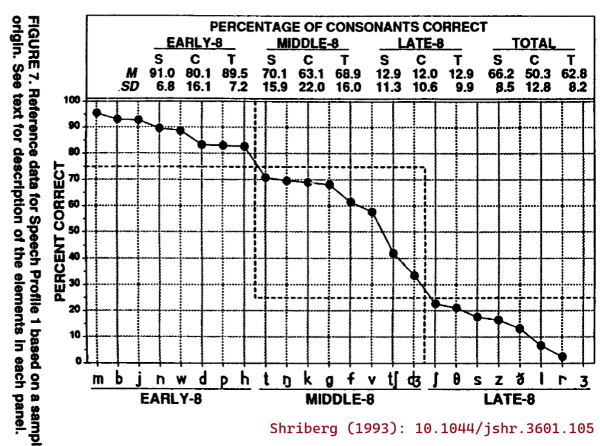
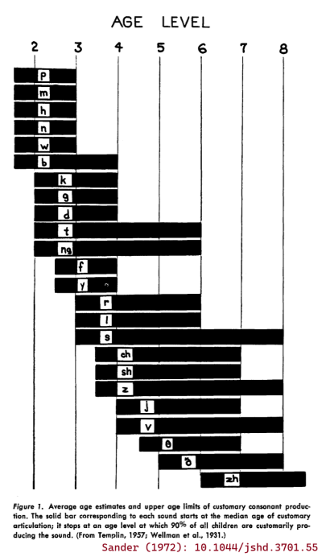

# Acquisition and developmental descriptions of consonants and vowels

This package provides dataframes of information about the consonants and
vowels in American English. The following datasets collect *acquisition*
(`acq`) features which (try to) characterize the expected acquisition or
speech-motor difficulty of speech sounds. See also
[data_features_consonants](https://www.tjmahr.com/wisclabmisc/reference/data_features_consonants.md).

## Usage

``` r
data_acq_consonants

data_acq_vowels
```

## Format

An object of class `tbl_df` (inherits from `tbl`, `data.frame`) with 24
rows and 16 columns.

An object of class `tbl_df` (inherits from `tbl`, `data.frame`) with 17
rows and 8 columns.

## Details

### Consonant acquisition features

`data_acq_consonants` provides the following features:

    knitr::kable(data_acq_consonants)

|       |        |         |                    |                  |                   |                   |                       |                 |            |           |                   |                 |                |                 |                |
|-------|--------|---------|--------------------|------------------|-------------------|-------------------|-----------------------|-----------------|------------|-----------|-------------------|-----------------|----------------|-----------------|----------------|
| phone | cmubet | wiscbet | cm2020_90_age_mean | cm2020_90_age_sd | cm2020_90_age_min | cm2020_90_age_max | cm2020_90_num_studies | cm2020_90_stage | s93_eights | k1992_set | kd2018_complexity | hml84_frequency | hml84_log10fpm | mhr82_frequency | mhr82_log10fpm |
| p     | P      | p       | 33.2               | 6.9              | 24                | 48                | 12                    | early           | early      | 1         | 3                 | 50694           | 4.276690       | 14851           | 4.230197       |
| b     | B      | b       | 31.4               | 7.8              | 24                | 48                | 13                    | early           | early      | 2         | 4                 | 51831           | 4.286323       | 18027           | 4.314365       |
| t     | T      | t       | 38.5               | 9.2              | 24                | 60                | 13                    | early           | middle     | 3         | 5                 | 188536          | 4.847127       | 69108           | 4.897970       |
| d     | D      | d       | 35.7               | 6.7              | 24                | 48                | 13                    | early           | early      | 2         | 4                 | 102205          | 4.581205       | 47838           | 4.738214       |
| k     | K      | k       | 37.7               | 7.3              | 24                | 48                | 13                    | early           | middle     | 2         | 4                 | 73250           | 4.436541       | 25462           | 4.464334       |
| g     | G      | g       | 36.8               | 6.6              | 24                | 48                | 13                    | early           | middle     | 2         | 4                 | 19422           | 3.860027       | 15789           | 4.256796       |
| tʃ    | CH     | tsh     | 53.5               | 10.7             | 36                | 72                | 12                    | middle          | middle     | 4         | 6                 | 17147           | 3.805921       | 3149            | 3.556614       |
| dʒ    | JH     | dzh     | 51.0               | 11.8             | 36                | 72                | 13                    | middle          | middle     | 4         | 6                 | 13220           | 3.692964       | 3015            | 3.537729       |
| m     | M      | m       | 33.2               | 6.7              | 24                | 48                | 13                    | early           | early      | 1         | 3                 | 75850           | 4.451689       | 25799           | 4.470044       |
| n     | N      | n       | 33.1               | 7.4              | 24                | 48                | 13                    | early           | early      | 1         | 3                 | 204939          | 4.883358       | 68331           | 4.893059       |
| ŋ     | NG     | ng      | 40.3               | 10.8             | 24                | 55                | 10                    | early           | middle     | 3         | 5                 | 13692           | 3.708200       | 9102            | 4.017578       |
| f     | F      | f       | 38.3               | 6.3              | 24                | 48                | 13                    | early           | middle     | 2         | 4                 | 51526           | 4.283759       | 10731           | 4.089082       |
| v     | V      | v       | 50.8               | 10.8             | 36                | 66                | 12                    | middle          | middle     | 4         | 6                 | 66490           | 4.394489       | 8753            | 4.000598       |
| θ     | TH     | th      | 77.0               | 7.4              | 72                | 96                | 10                    | late            | late       | 4         | 6                 | 18300           | 3.834184       | 4337            | 3.695631       |
| ð     | DH     | dh      | 69.0               | 11.3             | 54                | 96                | 12                    | late            | late       | 4         | 6                 | 108602          | 4.607571       | 35995           | 4.614683       |
| s     | S      | s       | 51.3               | 16.3             | 24                | 84                | 12                    | middle          | late       | 4         | 6                 | 114733          | 4.631421       | 33752           | 4.586741       |
| z     | Z      | z       | 56.8               | 14.3             | 30                | 84                | 11                    | middle          | late       | 4         | 6                 | 54454           | 4.307763       | 24027           | 4.439141       |
| ʃ     | SH     | sh      | 55.0               | 10.5             | 36                | 72                | 12                    | middle          | late       | 4         | 6                 | 21756           | 3.909312       | 4844            | 3.743645       |
| ʒ     | ZH     | zh      | 70.7               | 12.2             | 60                | 84                | 3                     | late            | late       | 4         | 6                 | 1488            | 2.744336       | 100             | 2.058441       |
| h     | HH     | h       | 35.0               | 7.0              | 24                | 48                | 13                    | early           | early      | 1         | 3                 | 51235           | 4.281300       | 18896           | 4.334811       |
| l     | L      | l       | 53.8               | 10.4             | 24                | 60                | 12                    | middle          | late       | 3         | 5                 | 98287           | 4.564229       | 29343           | 4.525946       |
| r     | R      | r       | 66.6               | 18.6             | 30                | 96                | 12                    | late            | late       | 3         | 5                 | 121548          | 4.656481       | 29534           | 4.528764       |
| w     | W      | w       | 35.2               | 6.8              | 24                | 48                | 13                    | early           | early      | 1         | 3                 | 60251           | 4.351697       | 25171           | 4.459342       |
| j     | Y      | j       | 45.8               | 11.0             | 30                | 60                | 13                    | early           | early      | 2         | 4                 | 16510           | 3.789480       | 8544            | 3.990103       |

Description of each column:

- phone:

  phone in IPA

- cmubet:

  phone in the CMU alphabet

- wiscbet:

  phone in an older system used by our lab

- cm2020_90_age_mean, cm2020_90_age_sd, cm2020_90_age_min,
  cm2020_90_age_max:

  Age of acquisition statistics reported by Crowe & McLeod (2020).
  Statistics are the mean, SD, min and max age (in months) when children
  reached 90% accuracy on a consonant.

- cm2020_90_num_studies:

  Number of studies used by Crowe & McLeod (2020) to compute the
  corresponding statistics.

- cm2020_90_stage:

  Developmental stage assigned to the consonant by Crowe & McLeod
  (2020). Sounds with an `age_mean` before 48 months are `early`, before
  60 months are `middle`, and of 60 or older are `late`.

- s93_eights:

  Developmental stage of Shriberg (1993)—that is, the `early` 8,
  `middle` 8 and `late` 8 consonants.

- k1992_set:

  Developmental set from Kent (1992). Sets corresponds to the age of 90%
  mastery in Sander (1972): Set 1 is mastered at age 3-years-old, Set 2
  at age 4, Set 3 at age 6, and Set 4 at a later age.

- kd2018_complexity:

  Phonetic complexity scores from Kuruvilla-Dugdale et al. (2018). This
  scoring system is based on the development description of vowels and
  consonants in Kent (1992). The scores for individual segments range
  from 1 for the earliest vowels to 6 for the last-acquired consonants.
  Under this system, assign a score to each part of a syllable (onset,
  nucleus, coda) using these scores when the syllable part is a single
  segment and using scores of 7 and 8 for 2-consonant and 3-consonant
  clusters, respectively.

- hml84_frequency, hml84_log10fpm:

  Raw frequency and log10 frequency per million of the phoneme in the
  Hoosier Mental Lexicon (Nusbaum, Pisoni, Pisoni, 1984) word-frequency
  dictionary.

- mhr82_frequency, mhr82_log10fpm:

  Raw frequency and log10 frequency per million of the phoneme in the
  Moe, Hopkins, and Rush (1982) word frequency dictionary of
  first-graders.

### Vowel acquisition features

`data_acq_vowels` provides the following features:

    knitr::kable(data_acq_vowels)

|       |        |         |                   |                 |                |                 |                |
|-------|--------|---------|-------------------|-----------------|----------------|-----------------|----------------|
| phone | cmubet | wiscbet | kd2018_complexity | hml84_frequency | hml84_log10fpm | mhr82_frequency | mhr82_log10fpm |
| i     | IY     | i       | 2                 | 82430           | 4.487818       | 28537           | 4.513850       |
| ɪ     | IH     | I       | 4                 | 195348          | 4.862542       | 43999           | 4.701884       |
| eɪ    | EY     | eI      | 4                 | 38966           | 4.162419       | 16679           | 4.280611       |
| ɛ     | EH     | E       | 3                 | 73107           | 4.435692       | 31322           | 4.554291       |
| æ     | AE     | ae      | 4                 | 106838          | 4.600459       | 40290           | 4.663639       |
| ʌ     | AH     | ^       | 1                 | 44555           | 4.220629       | 22826           | 4.416871       |
| ə     | AH     | 4       | 1                 | 231568          | 4.936412       | 38977           | 4.649250       |
| u     | UW     | u       | 2                 | 57320           | 4.330039       | 19188           | 4.341471       |
| ʊ     | UH     | U       | 4                 | 13557           | 3.703897       | 4288            | 3.690696       |
| oʊ    | OW     | oU      | 2                 | 61954           | 4.363802       | 17330           | 4.297240       |
| ɔ     | AO     | c       | 3                 | 26110           | 3.988540       | 12004           | 4.137767       |
| ɑ     | AA     | @       | 1                 | 36589           | 4.135084       | 17326           | 4.297140       |
| aʊ    | AW     | @U      | 3                 | 16079           | 3.777992       | 7377            | 3.926321       |
| aɪ    | AY     | @I      | 3                 | 39275           | 4.165849       | 23807           | 4.435146       |
| ɔɪ    | OY     | cI      | 3                 | 2140            | 2.902147       | 744             | 2.930014       |
| ɝ     | ER     | 3^      | 5                 | 17048           | 3.803406       | 4227            | 3.684474       |
| ɚ     | ER     | 4^      | 5                 | 41966           | 4.194631       | 10676           | 4.086850       |

- phone:

  phone in IPA

- cmubet:

  phone in the CMU alphabet

- wiscbet:

  phone in an older system used by our lab

- kd2018_complexity:

  Phonetic complexity scores from Kuruvilla-Dugdale et al. (2018). This
  scoring system is based on the development description of vowels and
  consonants in Kent (1992). The scores for individual segments range
  from 1 for the earliest vowels to 6 for the last-acquired consonants.
  Under this system, assign a score to each part of a syllable (onset,
  nucleus, coda) using these scores when the syllable part is a single
  segment and using scores of 7 and 8 for 2-consonant and 3-consonant
  clusters, respectively.

- hml84_frequency, hml84_log10fpm:

  Raw frequency and log10 frequency per million of the phoneme in the
  Hoosier Mental Lexicon (Nusbaum, Pisoni, Pisoni, 1984) word-frequency
  dictionary.

- mhr82_frequency, mhr82_log10fpm:

  Raw frequency and log10 frequency per million of the phoneme in the
  Moe, Hopkins, and Rush (1982) word frequency dictionary of
  first-graders.

### Crowe and McLeod (2020) norms for English consonant acquisition

Crowe and McLeod (2020, below as the `cm2020_` variables) provides a
systematic review and summary statistics for age of acquisition norms
for English consonants. They scoured the literature of acquisition ages
for individual consonants and computed summary statistics on them. They
considered just accuracy of sounds when produced in single words. Their
sources include a mix of a journal articles and norms for articulation
assessments. They do not weight statistics from individual studies by
sample size or sampling procedure.

I prepared the Crowe and McLeod (2020) data by copying the relevant
numbers from their Table 2 making the following changes: 1) rounding
mean and SD values to 1 decimal point (3 days for ages in months), 2)
dropping /ʍ/, 3) using /r/, /g/, /tʃ/, /dʒ/ for IPA characters instead
of the specialized characters used in the article.

### English language phoneme frequencies

The `hml84_frequency` column provides the frequency count for the
phonemes in the Hoosier Mental Lexicon (Nusbaum, Pisoni, Pisoni, 1984).
That is, we count how many times the phonemes appear in each word in the
word list and weight them by the word frequency. For example, "ad" has
two phonemes and a corpus frequency of 99, so it counts for 99 /æ/
tokens and 99 /d/ tokens.

The HML frequency counts derive from the Brown Corpus of one million
English words that were printed/published in 1961. The HML provides
frequencies of *phonological* words, and homophones are combined into a
single entry. For example, the word "ad" has a frequency of 99 (11 *ad*
tokens plus 88 *add* tokens). That's why, I suppose, it's a *mental*
lexicon. Approximately 8,000 words in the HML were not in the K&F
frequency word list, and these are apparently assigned a frequency of 1.

The `mhr82_frequency` column was constructed in a similar way but the
frequencies were based on a corpus of words used by first-graders (Moe,
Hopkins, & Rush, 1982).

The `hml84_log10fpm` and `mhr82_log10fpm` columns provide the frequency
in log-10 frequency per million which is more appropriate for analyses.
Computing frequency per million normalize the frequency counts across
different corpora, and log-frequency is better suited than raw or
normalized frequency counts.

I computed these phoneme frequencies independently, but retrieved my
copies of the HML and MHR frequency-pronunciation tables from [a
course](https://kb.osu.edu/items/6b1379d3-e15d-53e4-99b6-85f2bb09b3af)
by Smith, Beckman and Foltz (2016).

### The early 8, middle 8 and late 8 (Shriberg, 1993)

The English consonants are often broken down into three developmental
classes, based on Shriberg (1993):

- Early 8: m b j n w d p h

- Middle 8: t ŋ k g f v tʃ dʒ,

- Late 8: ʃ θ s z ð l r ʒ

This classification is included as the `s93_eights` column.

From these names alone, we might interpret these classes such that
sounds in the Early 8 would be acquired before the ones in the Middle 8,
and likewise that the Middle 8 would be acquired before the Late 8. But
these classes were not created by examining patterns of typical
consonant acquisition.

For some context, Shriberg (1993) introduces the Early 8, Middle 8, and
Late 8 data by describing the following panel of the article's Figure 7:



About which, Shriberg (1993) says: *"The values for this trend, which is
a profile of consonant mastery, were taken from a group of 64 3- to
6-year-old speech-delayed children Shriberg, Kwiatkowski, & Gruber,
1992). Severity of involvement of the 24 English consonants is
represented as the percentage correct for each consonant sorted in
decreasing order from left to right. Notice that the most obvious breaks
in this function allow for a division of the 24 consonants into three
groups of eight sounds termed the **Early-8**, averaging over 75%
correct, the **Middle-8**, averaging 25%-75% correct, and the
**Late-8**, including consonants averaging less than 25% correct in
continuous conversational speech (/ʒ/ is infrequently represented in
young, speech-delayed children's spontaneous conversational speech)."*

So, there were 64 3–6-year-old children with speech delays, and
consonant sounds were divided into three classes based on how often
*these children* produced the sounds correctly on average in a
conversational speech sample. This classification is not so much a
measure of the relative ordering of speech sound development as it is
**the relative difficulty of these sounds for children with a speech
delay of unknown origin**. It would be more appropriate to replace the
levels of Early/Middle/Late with Easy/Medium/Hard.

### Phonetic complexity (Kent, 1992; Kuruvilla-Dugdale et al. 2018)

Phonetic complexity measures (`k1992_set` and `kd2018_complexity`)
assign the speech sounds different complexity levels based on biological
principles outlined in Kent (1992). Because Kent (1992) is a book
chapter that is not floating around online, it's worthwhile to review
the provenance of these complexity measures. In short, Kent (1992)
applied interpreted consonant and vowel development data in terms of
their motor demands.

Sander (1972) set out to construct a set of developmental norms for
typical consonant acquisition in English. His big idea was to include
the median age of acquisition as well as the 90th percentile age of
acquisition. The median can tell us something about the average
acquisition of the speech sounds, and the 90th percentile can set a
benchmark for delayed acquisition. There are some quirks of the
methodology. First, Sander (1972) was targeting "customary articulation"
which was defined using production accuracy average across word
positions. So, the age of 50% customary articulation for /t/ is the
earliest age when the average of word-initial accuracy, word-medial
accuracy and word-final accuracy is greater than 50%. Second, the norms
for this study were created by augmenting data from 3–8-year-olds
(Templin, 1957; *n* = 480) with some earlier data for 2-year-olds
(Wellman et al. 1931; *n* = 15).

Sander (1972) presented these acquisition norms in the following figure:



Kent (1992) aimed to explain the course of English sound development in
terms of biological and motoric principles. He examined the ages of 90%
acquisition from Sander (1972)—that is, the right edges of the bars in
the previous figure—and observed that /p m n w h/ are mastered at age 3,
/b d k g j f/ at age 4, /t ŋ r l/ at age 6 and /s z ʃ ʒ v θ ð tʃ dʒ/
after age 7. He then described motoric demands in each of these sets of
sounds. I'll paraphrase:

- Set 1 requires fast "ballistic" movements for stops /p m n/, slow
  "ramp" movements for /w h/, velopharyngeal control for oral-nasal
  contrast, laryngeal control for voicing contrast.

- Set 2 adds more stops /b d k g/ and another ramp /j/ and a new place
  of articulation (velars), but also requires "fine force regulation for
  frication" for /f/.

- Set 3 adds more stops /t ŋ/, but also requires tongue "bending" for
  /r/ and /l/.

- Set 4 adds more lingual fricatives /s z ʃ ʒ θ ð/ which require tongue
  bending and fine force control along with /v tʃ dʒ/. Kent does not
  characterize the motor demands for the affricates /tʃ dʒ/.

Let's pause for a moment and observe that this breakdown is just an
attempt to describe the Sander (1972) norms, and it is somewhat
underdeveloped. For example, why is /t/ in Set 3 but /d/ in Set 2? It is
not answered here, but I think this late mastery is an artefact of
Sander's requirement of 90% accuracy averaging over the three
word-positions. The medial and final productions of /t/ might require
allophonic variation in /t/ (e.g., flapping or glottalization), so
mastery of /t/ would require different motor gestures and some
phonological knowledge on the part of the child. But in Kent's
description /t/ is a later-mastered ballistic movement.

Still, the main point of Kent's description, I think, is that lingual
(tongue) consonants are more difficult. Elsewhere in the chapter, Kent
(1992) describes how the tongue is a "muscular hydrostat" like an
elephant trunk, and bending a hydrostat requires coordination of
different muscle directions:

*"Gaining motor control over a hydrostat presents some special problems
to the young child learning speech. For one, bending the hydrostat is
unlike bending a jointed structure such as a finger. The tongue has no
joints per se; it flexes by appropriate contraction of its
three-dimensional network of intrinsic longitudinal, vertical, and
transverse fibers. Bending a hydrostat requires that muscle fibers be
shortened on one aspect simultaneously with a resistance to a change in
diameter (Smith and Kier 1989). If the diameter change is not resisted,
then the hydrostat will shorten on one side but will not bend. To use
the tongue in speech, the child must learn to control the tongue to meet
skeletal, movement, and shaping requirements, often simultaneously.
These special characteristics of the tongue may well play a role in
vowel and consonant mastery."*

Kim and colleagues (2010) applied these developmental sets (`k1992_set`)
as articulatory complexity *levels* while examining consonant errors in
dysarthric speech. They then asked questions such as whether more
complex consonants had more consonant errors than less complex ones
(*yes*) or whether lower intelligibility speakers made more
complexity-reducing consonant substitutions than higher intelligibility
speakers (*apparently so*). Examining the speech of 5-year-olds, Allison
and Hustad (2014) later used these complexity levels as a way to *score*
the phonetic complexity of sentences. They assigned consonants 1–5
scores (the 1–4 complexity levels with a score of 5 for consonants
clusters), and summed up the scores to provide a complexity score for a
sentence. Three of the eight 5-year-olds with dysarthria showed a
negative effect of sentence complexity on intelligibility.

Kent (1992) also described the yearly developmental progression of
vowels. I'll paraphrase again:

- By age 1: Infants produce *vocants* (vowel precursors) which
  correspond to the low-front, central and low-back vowels /æ ɛ ʌ ə ɑ/.
  Thus, the tongue only moves in the anterior-posterior direction (i.e.,
  there is limited up-down movement).

- By age 2: Toddlers produce the "maximally dissimilar" corner vowels /i
  u ɑ/ and produce /o/ and the central vowels /ʌ ə/.

- By age 3: Children incorporate two lower vowels /ɛ ɔ/ and the
  diphthongs /aɪ aʊ ɔɪ/ which require gliding movements.

- By age 4: Children incorporate the remaining non-rhotic vowels /ʊ ɪ e
  æ/. The appearance of the front vowels suggests that tongue-jaw
  coordination is a relatively late motor achievement. (/i/ appears
  earlier because its extreme height is easy.)

- Lastly: Children incorporate /ɚ ɝ/ last because these r-colored vowels
  require tongue bending.

Kuruvilla-Dugdale and colleagues (2018) used this description to
incorporate vowels into the phonetic complexity scale
(`kd2018_complexity`). The /ʌ ə ɑ/ vocants from age 1 and the vowels
from age 2 mark the bottom of the complexity scale. The vowels that are
acquired at ages 3, 4 and afterwards are assigned to the consonant
complexity levels with the same age of mastery. Finally, consonant
clusters serve as the ceiling for the scale:

Table: Phonetic complexity scores from Kuruvilla-Dugdale et al. (2018).

|                   |                      |              |
|-------------------|----------------------|--------------|
| kd2018_complexity | consonants           | vowels       |
| 1                 |                      | ʌ ə ɑ        |
| 2                 |                      | i u oʊ       |
| 3                 | p m n h w            | ɛ ɔ aʊ aɪ ɔɪ |
| 4                 | b d k g f j          | ɪ eɪ æ ʊ     |
| 5                 | t ŋ l r              | ɝ ɚ          |
| 6                 | tʃ dʒ v θ ð s z ʃ ʒ  |              |
| 7                 | 2-consonant clusters |              |
| 8                 | 3-consonant clusters |              |

It is not clear how to apply this scale, so my approach has been to
break words into subsyllabic units and assign scores to the syllable
onsets, nucleui and codas in each word. For example, "jump" is /dʒ/ +
/ʌ/ + /mp/ so it would have complexity of 6 + 1 + 7 = 14, and "jumper"
includes a syllable break between the cluster, so it would have a score
6 + 1 + 1 + 1 + 5 = 14.

Kuruvilla-Dugdale and colleagues (2018) used this scoring system to
compare intelligibility for low complexity versus high complexity words.
For example, for speakers with ALS and mild dysarthria, there was
statistically clear reduction in intelligibility for high complexity
words but not for low complexity words. I applied this scoring system on
single-word intelligibility in children's speech (Mahr & Hustad, 2023).
There was a probable but not statistically clear negative effect of
complexity on intelligibility over and above the effects of age, word
frequency and word neighborhood competition. (Regrettably, I coded the
one consonant cluster in the word list with a complexity of 8 instead of
7, but otherwise this is the approach.)

## References

Allison, K. M., & Hustad, K. C. (2014). Impact of sentence length and
phonetic complexity on intelligibility of 5-year-old children with
cerebral palsy. *International Journal of Speech-Language Pathology*,
*16*(4), 396–407. <https://doi.org/10.3109/17549507.2013.876667>

Crowe, K., & McLeod, S. (2020). Children’s English Consonant Acquisition
in the United States: A Review. *American Journal of Speech-Language
Pathology*, *29*(4), 2155–2169.
<https://doi.org/10.1044/2020_AJSLP-19-00168>

Kent, R. D. (1992). The Biology of Phonological Development. In C. A.
Ferguson, L. Menn, & C. Stoel-Gammon (Eds.), *Phonological development:
Models, research, implications* (pp. 65–90). York Press.

Kim, H., Martin, K., Hasegawa-Johnson, M., & Perlman, A. (2010).
Frequency of consonant articulation errors in dysarthric speech.
*Clinical Linguistics and Phonetics*, *24*(10), 759–770.
<https://doi.org/10.3109/02699206.2010.497238>

Kuruvilla-Dugdale, M., Custer, C., Heidrick, L., Barohn, R., &
Govindarajan, R. (2018). A Phonetic Complexity-Based Approach for
Intelligibility and Articulatory Precision Testing: A Preliminary Study
on Talkers With Amyotrophic Lateral Sclerosis. *Journal of Speech,
Language, and Hearing Research*, *61*(9), 2205–2214.
<https://doi.org/10.1044/2018_JSLHR-S-17-0462>

Mahr, T. J., & Hustad, K. C. (2023). Lexical Predictors of
Intelligibility in Young Children’s Speech. *Journal of Speech,
Language, and Hearing Research*, 66(8S), 3013–3025.
<https://doi.org/10.1044/2022_JSLHR-22-00294>

Sander, E. K. (1972). When are Speech Sounds Learned? *Journal of Speech
and Hearing Disorders*, *37*(1), 55–63.
<https://doi.org/10.1044/jshd.3701.55>

Shriberg, L. D. (1993). Four New Speech and Prosody-Voice Measures for
Genetics Research and Other Studies in Developmental Phonological
Disorders. *Journal of Speech, Language, and Hearing Research*, *36*(1),
105–140. <https://doi.org/10.1044/jshr.3601.105>
